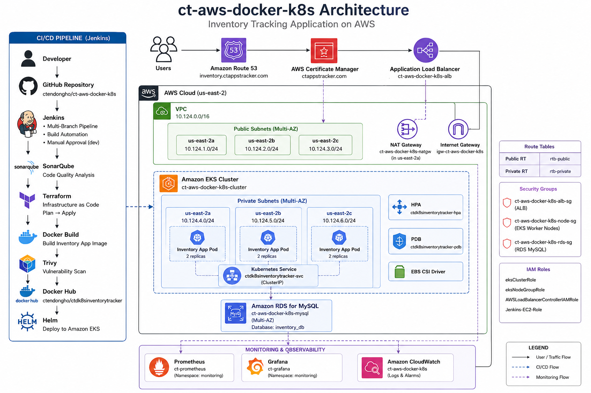
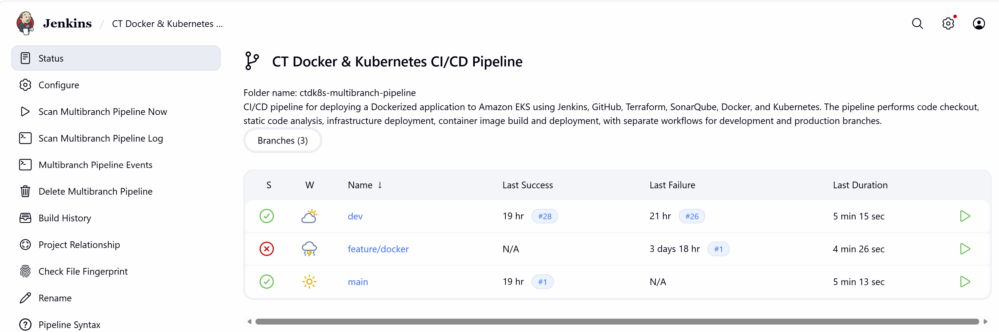
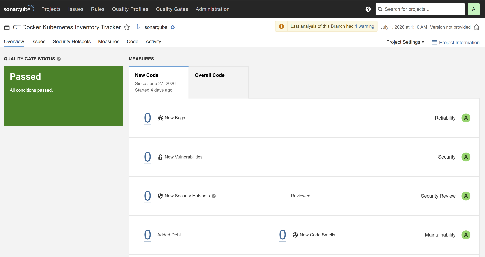
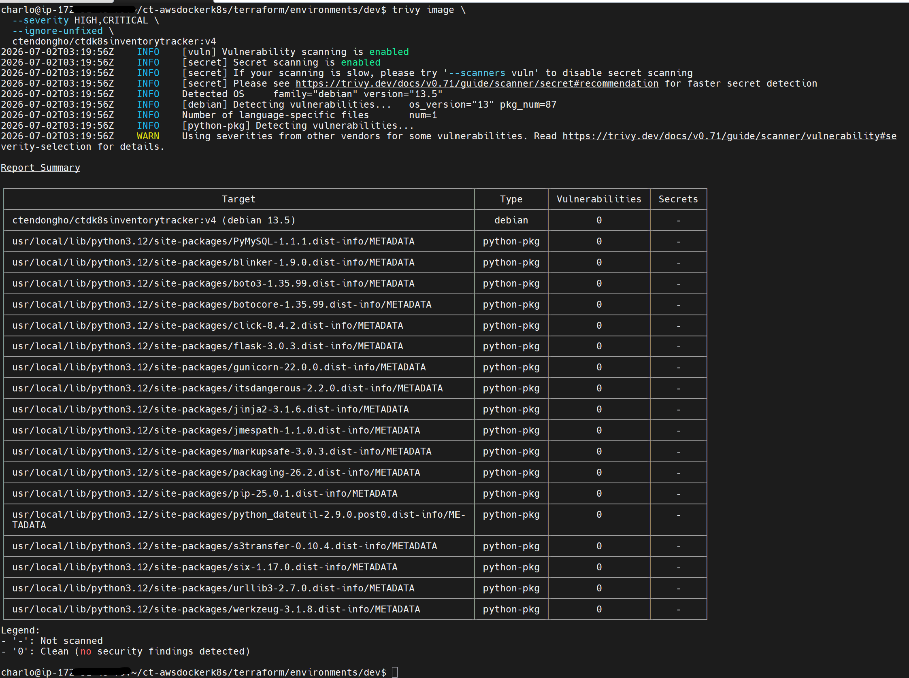
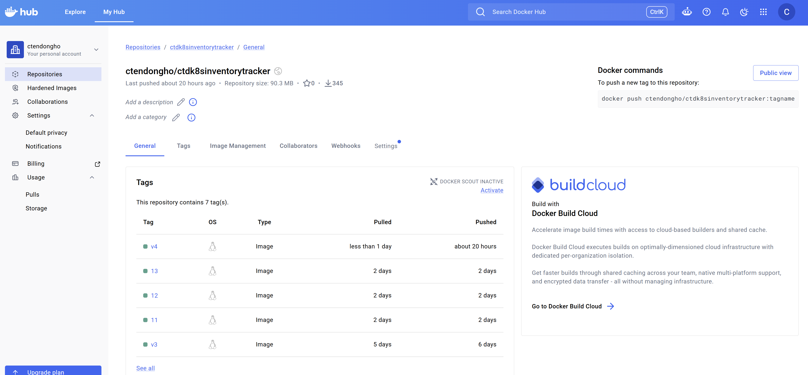
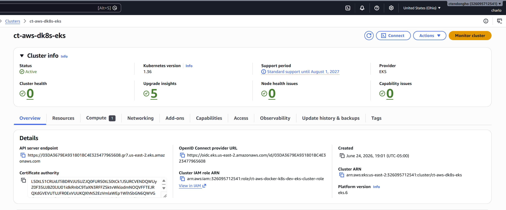
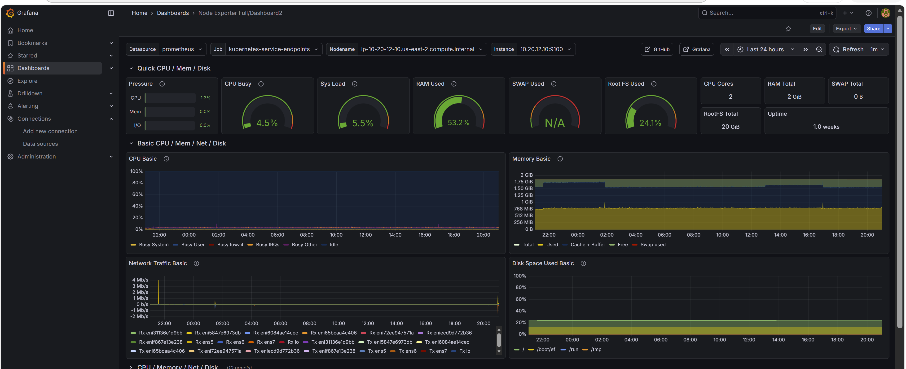
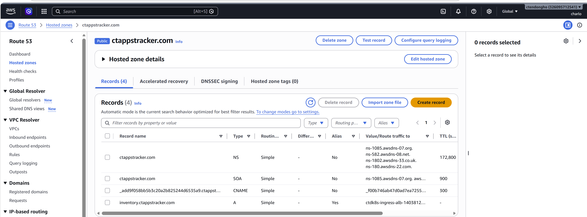
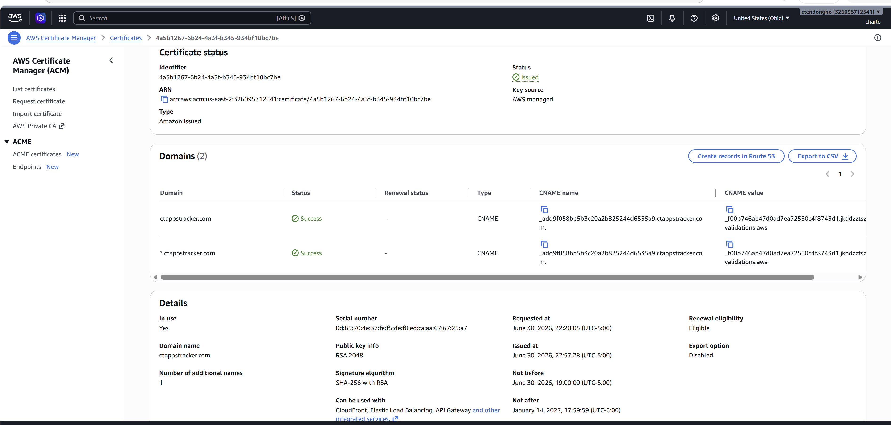
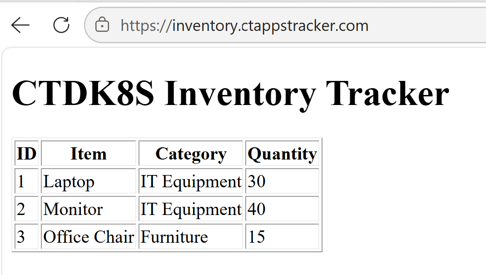

# End-to-End Application Delivery with Docker and Kubernetes on AWS


A production-ready application delivery platform built on AWS using Infrastructure as Code, containerization, Kubernetes orchestration, and an automated CI/CD pipeline. The platform deploys a containerized Inventory Tracking application to Amazon EKS using Terraform, Docker, Helm, and Jenkins while integrating security scanning, monitoring, and high availability best practices.

---

# Overview

This project demonstrates a complete application delivery workflow on AWS using modern DevOps and cloud-native technologies.

The infrastructure is provisioned with Terraform, the Inventory Tracking application is containerized with Docker, deployed to Amazon EKS using Helm, and delivered automatically through a Jenkins CI/CD pipeline.

The platform also integrates SonarQube for code quality analysis, Trivy for container image security scanning, Prometheus, Grafana and Amazon CloudWatch for monitoring, Amazon RDS MySQL as the backend database, Amazon Route 53 for DNS management, AWS Certificate Manager (ACM) for TLS certificates, and an AWS Application Load Balancer (ALB) to securely expose the application over HTTPS.

---

# Live Demo

**Application URL**

https://inventory.ctappstracker.com

---

# Solution Architecture



---

# Technologies Used

| Category | Technology |
|------------|------------|
| Cloud Platform | AWS |
| Infrastructure as Code | Terraform |
| Containerization | Docker |
| Container Registry | Docker Hub |
| Container Orchestration | Kubernetes (Amazon EKS) |
| Kubernetes Package Manager | Helm |
| CI/CD | Jenkins |
| Source Control | Git & GitHub |
| Code Quality | SonarQube |
| Container Security | Trivy |
| Ingress | AWS Load Balancer Controller |
| Load Balancing | AWS Application Load Balancer |
| DNS | Amazon Route 53 |
| TLS | AWS Certificate Manager |
| Database | Amazon RDS MySQL |
| Monitoring | Prometheus, Grafana & Amazon CloudWatch |
| Autoscaling | Kubernetes Horizontal Pod Autoscaler (HPA) |
| High Availability | Pod Disruption Budget (PDB) and Multi-AZ Amazon EKS Worker Nodes |

---

# Key Features

- Provisioned AWS infrastructure using Terraform
- Implemented remote Terraform state with Amazon S3 and DynamoDB
- Deployed a Multi-AZ Amazon EKS cluster
- Containerized the Inventory Tracking application with Docker
- Built a Jenkins multi-branch CI/CD pipeline
- Integrated SonarQube for static code analysis
- Integrated Trivy for container image vulnerability scanning
- Published Docker images to Docker Hub
- Deployed the application to Amazon EKS using Helm
- Configured Amazon RDS MySQL as the application database
- Implemented HTTPS using AWS Certificate Manager (ACM)
- Configured a custom domain using Amazon Route 53
- Exposed the application using an AWS Application Load Balancer (ALB)
- Configured Prometheus, Grafana and Amazon CloudWatch for monitoring
- Implemented Kubernetes Horizontal Pod Autoscaler (HPA)
- Configured Pod Disruption Budget (PDB)
- Separate deployment workflows for the `dev` and `main` branches

---

# Repository Structure

```text
.
├── app/
├── docs/
│   ├── architecture/
│   └── screenshots/
├── helm/
├── k8s/
├── monitoring/
├── terraform/
├── Jenkinsfile
├── sonar-project.properties
├── version.txt
├── LICENSE
└── README.md
```

---

# CI/CD Pipeline

```text
Developer
     │
     ▼
GitHub
     │
     ▼
Jenkins
     │
     ▼
SonarQube Scan
     │
     ▼
Terraform Init / Validate / Plan
     │
     ▼
Manual Approval (dev only)
     │
     ▼
Terraform Apply
     │
     ▼
Docker Build
     │
     ▼
Trivy Security Scan
     │
     ▼
Docker Push
     │
     ▼
Helm Deployment
     │
     ▼
Amazon EKS
     │
     ▼
Health Checks
```

The **dev** branch pauses for manual approval before Terraform Apply.

The **main** branch deploys automatically after all pipeline stages complete successfully.

---

# Deployment Guide

Clone the repository

```bash
git clone https://github.com/ctendongho/ct-aws-docker-k8s.git

cd ct-aws-docker-k8s
```

Configure AWS credentials

```bash
aws configure
```

Deploy the infrastructure

```bash
cd terraform/environments/dev

terraform init

terraform plan

terraform apply
```

Build the Docker image

```bash
docker build -t ctendongho/ctdk8sinventorytracker:v1 app/
```

Push the image

```bash
docker push ctendongho/ctdk8sinventorytracker:v1
```

Deploy the application

```bash
helm upgrade --install inventory \
helm/ctdk8sinventorytracker \
-n ct-aws-dk8s \
--create-namespace
```

---

# Validation

Verify Kubernetes resources

```bash
kubectl get pods -n ct-aws-dk8s

kubectl get svc -n ct-aws-dk8s

kubectl get ingress -n ct-aws-dk8s

helm list -n ct-aws-dk8s
```

Verify the application

```bash
curl -I https://inventory.ctappstracker.com
```

Verify the database

```bash
aws rds describe-db-instances \
--db-instance-identifier ct-aws-docker-k8s-mysql \
--query "DBInstances[0].[DBInstanceStatus,Engine,EngineVersion,Endpoint.Address]" \
--output table
```

---

# Platform Screenshots

## Jenkins Multi-Branch Pipeline

Automated CI/CD pipeline supporting both development and production deployments.



---

## SonarQube Dashboard

Static code analysis with a passing Quality Gate and no new bugs, vulnerabilities, or code smells.



---

## Trivy Container Security Scan

Container image security scan showing no HIGH or CRITICAL vulnerabilities.



---

## Docker Hub Repository

Versioned Docker images published automatically by the CI/CD pipeline.



---

## Amazon EKS Cluster

Production Kubernetes cluster hosting the Inventory Tracking application.



---

## Monitoring Dashboard

Grafana dashboard displaying Prometheus metrics collected from the Kubernetes cluster.



---

## Amazon Route 53

DNS configuration for the custom application domain.



---

## AWS Certificate Manager

TLS certificate providing secure HTTPS access to the application.



---

## Inventory Tracking Application

Live application deployed to Amazon EKS and accessible through HTTPS.



---

# Challenges Faced

- Jenkins initially could not run Docker commands because Docker was unavailable inside the Jenkins container and access to the Docker socket was denied. This was resolved by installing Docker inside Jenkins and correcting socket permissions.

- SonarQube scans completed successfully, but the Quality Gate stage timed out while waiting for the webhook callback. The pipeline was updated to keep the scan while removing the blocking Quality Gate stage.

- Helm could not manage Kubernetes resources that had originally been created manually. The resources were removed and recreated through the Helm chart so they became part of the Helm release.

- After configuring Route 53, the custom domain temporarily returned **NXDOMAIN** while DNS changes propagated. The issue was confirmed by checking the authoritative Route 53 name servers and clearing the local DNS cache.

- The Jenkins health check originally validated the Kubernetes LoadBalancer endpoint. After introducing ALB Ingress and HTTPS, it was updated to validate the production URL.

---

# Lessons Learned

This project reinforced how Infrastructure as Code, containers, Kubernetes, CI/CD, monitoring, security, DNS, and cloud networking come together to deliver a production-ready application.

The biggest takeaway was understanding how every stage of the delivery pipeline—from source code to a secure HTTPS endpoint—works together as a complete platform rather than as isolated technologies.

---

# Future Enhancements

- GitOps deployment with Argo CD
- ExternalDNS for automatic Route 53 record management
- Prometheus Alertmanager notifications
- Blue/Green deployments
- Canary deployments
- Dedicated Development, Staging and Production environments

---

# License

This project is licensed under the MIT License.
